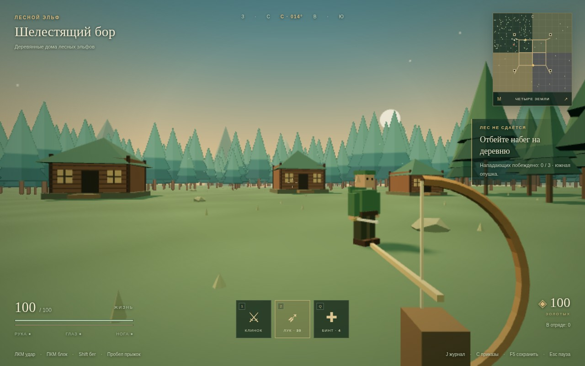

# КОРОВАНЫ — цифровой музей одного ТЗ

> «Здраствуйте. Я, Кирилл. Хотел бы чтобы вы сделали игру, 3Д-экшон суть такова...
> Можно грабить корованы... P.S. Я джва года хочу такую игру.»

## Что это такое

**Цифровой музей одного техзадания.** Есть легендарный мемный промпт от Кирилла
(«джва года хочу такую игру»). Мы даём **один и тот же промпт** разным AI-моделям
и просим каждую сделать свою игру по этому ТЗ. Каждая модель работает вслепую —
не видит варианты соседей — и складывает результат в свою директорию. Потом всё
можно **сравнить и поиграть** в один клик: видно, как разные модели по-разному
понимают и реализуют одно и то же творческое задание.

🎮 **Играть:** https://rai220.github.io/korovany/

## Идея и промпт

Оригинальное ТЗ, которое получают все модели дословно:

> Здраствуйте. Я, Кирилл. Хотел бы чтобы вы сделали игру, 3Д-экшон суть такова... Пользователь может играть лесными эльфами, охраной дворца и злодеем. И если пользователь играет эльфами то эльфы в лесу, домики деревяные набигают нагибают солдаты дворца и злодеи. Можно грабить корованы... И эльфу раз лесные то сделать так что там густой лес... А движок можно поставить так что вдали деревья картинкой, когда подходиш они преобразовываются в 3-хмерные деревья. Можно покупать и т.п. возможности как в Daggerfall. И враги 3-хмерные тоже, и труп тоже 3д. Можно прыгать и т.п. Если играть за охрану дворца то надо слушаться командира, и защищать дворец от злого (имя я не придумал) и шпионов, партизанов эльфов, и ходит на набеги на когото из этих (эльфов, злого…). Ну а если за злого… то значит шпионы или партизаны эльфов иногда нападают, пользователь сам себе командир может делать что сам захочет прикажет своим войскам с ним самим напасть на дворец и пойдет в атаку. Всего в игре 4 зоны. Т.е. карта и на ней есть 4 зоны, 1 - зона людей (нейтрал), 2- зона императора (где дворец), 3-зона эльфов, 4 - зона злого… (в горах, там есть старый форт…)
>
> Так же чтобы в игре могли не только убить но и отрубить руку и если пользователя не вылечат то он умрет, так же выколоть глаз но пользователь может не умереть а просто пол экрана не видеть, или достать или купить протез, если ногу тоже либо умреш либо будеш ползать либо на коляске котаться, или самое хорошее… поставить протез. Сохранятся можно…
>
> P.S. Я джва года хочу такую игру.

Как это реализовано в каждом варианте: 3 фракции (лесные эльфы / охрана дворца /
злодей), 4 зоны (люди-нейтрал, император с дворцом, густой эльфийский лес,
горный форт злодея), LOD-лес («вдали деревья картинкой»), грабёж корованов,
3D-враги и 3D-трупы, прыжки, приказы командира и штурм дворца, расчленёнка
рука/глаз/нога с протезами и коляской, лавка как в Daggerfall, сохранения.

## Экспонаты музея (варианты по моделям)

Варианты на главной и в таблице отсортированы по дате выхода модели — от новых к старым.
На главной показаны даты релизов, а не создания игр; ссылки на источники находятся
в сворачиваемом блоке под карточками. Даты создания игр сохранены в отдельном
столбце таблицы (МСК). Рейтинг — субъективная оценка Кирилла, ★★★★★ = 5 звёзд.

Для ox-alpha указано начало публичного превью — 20 августа 2026; официальный
релиз под именем GLM-5.3-Flash состоялся 26 августа. Grok Bot — агентный продукт,
а не название модели, поэтому указана дата его запуска; базовая модель экспоната не установлена.

> **Текущая SOTA: GPT-6 (astra).** На данный момент это лучший вариант среди
> представленных реализаций и основной ориентир для сравнения следующих поколений.



| Модель | Релиз / запуск | Игра создана (МСК) | Рейтинг | Директория | Поиграть | Стек |
|---|---|---|---|---|---|---|
| **GPT-6 (astra) — SOTA** | [2026-09-03](https://openai.com/index/gpt-6-astra/) | 2026-09-05 14:07 | — | [`gpt-6-astra/`](gpt-6-astra/) | [играть](https://rai220.github.io/korovany/gpt-6-astra/) | Three.js (ES modules, CDN), ванильный JS, вид от 1-го лица, без сборки |
| **Fable 5.1** | [2026-09-01](https://www.anthropic.com/claude-fable-and-mythos-5-1) | 2026-09-03 20:41 | — | [`fable_5_1/`](fable_5_1/) | [играть](https://rai220.github.io/korovany/fable_5_1/) | Three.js (ES modules, CDN), вид от 1-го лица, без сборки |
| **ox-alpha (Hermes)** | [2026-08-20](https://openrouter.ai/stealth/ox-alpha) (превью) | 2026-08-22 12:30 | — | [`hermes_ox_alpha/`](hermes_ox_alpha/) | [играть](https://rai220.github.io/korovany/hermes_ox_alpha/) | Three.js (ES modules, CDN), вид от 1-го лица, без сборки |
| **Grok Bot** | [2026-08-11](https://x.ai/news/introducing-grok-bot) (агент) | 2026-08-19 16:51 | — | [`grok_bot/`](grok_bot/) | [играть](https://rai220.github.io/korovany/grok_bot/) | Three.js (ES modules, CDN), вид от 1-го или 3-го лица, без сборки |
| **Opus 5** | [2026-07-24](https://www.anthropic.com/news/claude-opus-5) | 2026-07-25 15:07 | — | [`Opus-5/`](Opus-5/) | [играть](https://rai220.github.io/korovany/Opus-5/) | Three.js (ES modules, CDN), вид от 1-го лица, без сборки |
| **Kimi K3** | [2026-07-16](https://www.kimi.com/blog/kimi-k3) | 2026-07-22 11:46 | ★★★★★ | [`kimi-k3/`](kimi-k3/) | [играть](https://rai220.github.io/korovany/kimi-k3/) | Three.js (ES modules, локальная копия), вид от 3-го лица, без сборки |
| **GPT-5.6-sol** | [2026-07-09](https://openai.com/index/gpt-5-6/) | 2026-07-14 12:52 | — | [`gpt-5.6-sol/`](gpt-5.6-sol/) | [играть](https://rai220.github.io/korovany/gpt-5.6-sol/) | Three.js (ES modules, CDN), вид от 3-го лица, без сборки |
| **GLM-5.2** | [2026-06-16](https://z.ai/blog/glm-5.2) | 2026-06-18 11:47 | ★★★★☆ | [`glm-5.2/`](glm-5.2/) | [играть](https://rai220.github.io/korovany/glm-5.2/) | Three.js (ES modules, CDN), вид от 1-го лица, без сборки |
| **Fable 5** | [2026-06-09](https://www.anthropic.com/news/claude-fable-5-mythos-5) | 2026-06-10 08:57 | ★★★★★ | [`fable_5/`](fable_5/) | [играть](https://rai220.github.io/korovany/fable_5/) | Three.js, ванильный JS, без сборки |
| **Opus 4.8** | [2026-05-28](https://www.anthropic.com/news/claude-opus-4-8) | 2026-06-10 13:30 | ★★★☆☆ | [`Opus-4.8/`](Opus-4.8/) | [играть](https://rai220.github.io/korovany/Opus-4.8/) | Three.js, ванильный JS, вид от 1-го лица, без сборки |
| **GPT-5.5** | [2026-04-23](https://openai.com/index/introducing-gpt-5-5/) | 2026-06-10 13:50 | ★★☆☆☆ | [`gpt-5.5/`](gpt-5.5/) | [играть](https://rai220.github.io/korovany/gpt-5.5/) | Three.js, без сборки |

### GPT-6 (astra) — что внутри

- Три фракции с отдельными историями и свободной игрой после победы.
- Четыре бесшовные земли: нейтральные люди, дворец, деревянная деревня эльфов и горный форт.
- Густой процедурный лес: вдали картинки, в пределах 48 шагов объёмные деревья, instancing.
- Два корована с волами и конвоем, ограбления, обыск 3D-трупов, лавки и наёмники.
- Последовательные приказы дворцового командира; злодей сам командует отрядом и штурмует дворец.
- Потеря руки, глаза и ноги, смертельное кровотечение, бинты, коляска и протезы.
- Клинок, лук, блок, прыжки, карта, журнал, localStorage; проверка Chromium и скриншот.

### Opus 5 — что внутри

Вид от первого лица, весь мир 2×2 км без загрузок между зонами. Лес — 14 000 деревьев
на инстансинге: дальние рисуются картинкой, ближе 66 метров подменяются 3-хмерными
(в чаще одновременно ~160 объёмных и ~2200 картинок). Корованы из трёх повозок с
лошадьми и охраной ходят по тракту вдоль южной опушки эльфийского леса — специально
так, чтобы эльфам было кого грабить, — и помечены флагом, отметкой в HUD и точкой на
карте. Расчленёнка полная: отрубленная рука или нога отлетает отдельным объектом и
остаётся лежать, труп заваливается на землю и обыскивается; у игрока рука даёт
кровотечение (не перевяжешь — умрёшь), глаз закрывает пол-экрана, две ноги — ползание,
коляска или протез. Отряд нанимается за золото и по приказу идёт штурмовать вражескую
базу вместе с игроком. Шесть лавок, лекарь-протезист, быстрое перемещение по
разведанным зонам, сохранения в localStorage.

Подробности и полное управление — в [`Opus-5/README.md`](Opus-5/README.md).

## Как сравнить и поиграть

1. Открой главный индекс: https://rai220.github.io/korovany/ — там карточки всех вариантов.
2. Кликни по карточке модели — откроется её вариант игры.
3. Пройди по нескольким вариантам и сравни, как каждая модель поняла ТЗ:
   лес, корованы, дворец, форт, расчленёнку и приказы.

## Запуск локально

```bash
python3 -m http.server 8123
# открыть http://localhost:8123/
```

Все варианты — чистая статика (Three.js из CDN), деплоится на GitHub Pages
из корня ветки `main`. Новые экспонаты от других моделей добавляются в свою
директорию + карточка в корневой `index.html` и строка в этот README.
Для новой карточки нужна подтверждённая дата выхода модели и ссылка на первоисточник;
место в списке определяется этой датой (свежие сверху), не датой генерации игры.
