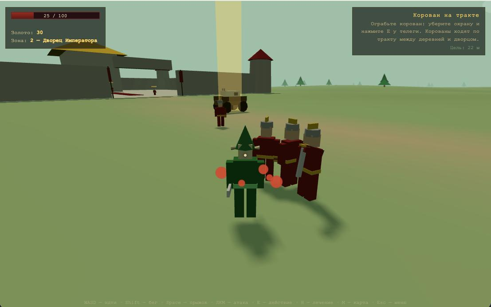

# КОРОВАНЫ — цифровой музей одного ТЗ

> «Здраствуйте. Я, Кирилл. Хотел бы чтобы вы сделали игру, 3Д-экшон суть такова...
> Можно грабить корованы... P.S. Я джва года хочу такую игру.»

## Что это такое

**Цифровой музей одного техзадания.** Есть легендарный мемный промпт от Кирилла
(«джва года хочу такую игру»). Мы даём **один и тот же промпт** разным AI-моделям
и просим каждую сделать свою игру по этому ТЗ. Каждая модель работает вслепую —
не видит варианты соседей — и складывает результат в свою директорию. Потом всё
можно **сравнить и поиграть** в один клик: видно, как разные модели по-разному
понимают и реализуют одно и то же творческое задание.

🎮 **Играть:** https://rai220.github.io/korovany/

## Идея и промпт

Оригинальное ТЗ, которое получают все модели дословно:

> Здраствуйте. Я, Кирилл. Хотел бы чтобы вы сделали игру, 3Д-экшон суть такова... Пользователь может играть лесными эльфами, охраной дворца и злодеем. И если пользователь играет эльфами то эльфы в лесу, домики деревяные набигают нагибают солдаты дворца и злодеи. Можно грабить корованы... И эльфу раз лесные то сделать так что там густой лес... А движок можно поставить так что вдали деревья картинкой, когда подходиш они преобразовываются в 3-хмерные деревья. Можно покупать и т.п. возможности как в Daggerfall. И враги 3-хмерные тоже, и труп тоже 3д. Можно прыгать и т.п. Если играть за охрану дворца то надо слушаться командира, и защищать дворец от злого (имя я не придумал) и шпионов, партизанов эльфов, и ходит на набеги на когото из этих (эльфов, злого…). Ну а если за злого… то значит шпионы или партизаны эльфов иногда нападают, пользователь сам себе командир может делать что сам захочет прикажет своим войскам с ним самим напасть на дворец и пойдет в атаку. Всего в игре 4 зоны. Т.е. карта и на ней есть 4 зоны, 1 - зона людей (нейтрал), 2- зона императора (где дворец), 3-зона эльфов, 4 - зона злого… (в горах, там есть старый форт…)
>
> Так же чтобы в игре могли не только убить но и отрубить руку и если пользователя не вылечат то он умрет, так же выколоть глаз но пользователь может не умереть а просто пол экрана не видеть, или достать или купить протез, если ногу тоже либо умреш либо будеш ползать либо на коляске котаться, или самое хорошее… поставить протез. Сохранятся можно…
>
> P.S. Я джва года хочу такую игру.

Как это реализовано в каждом варианте: 3 фракции (лесные эльфы / охрана дворца /
злодей), 4 зоны (люди-нейтрал, император с дворцом, густой эльфийский лес,
горный форт злодея), LOD-лес («вдали деревья картинкой»), грабёж корованов,
3D-враги и 3D-трупы, прыжки, приказы командира и штурм дворца, расчленёнка
рука/глаз/нога с протезами и коляской, лавка как в Daggerfall, сохранения.

## Экспонаты музея (варианты по моделям)

SOTA-варианты закреплены в начале таблицы, дальше — хронологический порядок от
первых к новым. Время указано по Москве. Рейтинг — субъективная оценка Кирилла,
★★★★★ = 5 звёзд.

> **Текущие SOTA: Kimi K3 и Fable 5.** На данный момент это лучшие варианты среди
> представленных реализаций и основной ориентир для сравнения следующих поколений.



| Модель | Дата | Рейтинг | Директория | Поиграть | Стек |
|---|---|---|---|---|---|
| **Kimi K3 — SOTA** | 2026-07-22 11:46 | ★★★★★ | [`kimi-k3/`](kimi-k3/) | [играть](https://rai220.github.io/korovany/kimi-k3/) | Three.js (ES modules, локальная копия), вид от 3-го лица, без сборки |
| **Fable 5 — SOTA** | 2026-06-10 08:57 | ★★★★★ | [`fable_5/`](fable_5/) | [играть](https://rai220.github.io/korovany/fable_5/) | Three.js, ванильный JS, без сборки |
| **Opus 4.8** | 2026-06-10 13:30 | ★★★☆☆ | [`Opus-4.8/`](Opus-4.8/) | [играть](https://rai220.github.io/korovany/Opus-4.8/) | Three.js, ванильный JS, вид от 1-го лица, без сборки |
| **GPT-5.5** | 2026-06-10 13:50 | ★★☆☆☆ | [`gpt-5.5/`](gpt-5.5/) | [играть](https://rai220.github.io/korovany/gpt-5.5/) | Three.js, без сборки |
| **GLM-5.2** | 2026-06-18 11:47 | ★★★★☆ | [`glm-5.2/`](glm-5.2/) | [играть](https://rai220.github.io/korovany/glm-5.2/) | Three.js (ES modules, CDN), вид от 1-го лица, без сборки |
| **GPT-5.6** | 2026-07-14 12:52 | — | [`gpt-5.6-sol/`](gpt-5.6-sol/) | [играть](https://rai220.github.io/korovany/gpt-5.6-sol/) | Three.js (ES modules, CDN), вид от 3-го лица, без сборки |

## Как сравнить и поиграть

1. Открой главный индекс: https://rai220.github.io/korovany/ — там карточки всех вариантов.
2. Кликни по карточке модели — откроется её вариант игры.
3. Пройди по нескольким вариантам и сравни, как каждая модель поняла ТЗ:
   лес, корованы, дворец, форт, расчленёнку и приказы.

## Запуск локально

```bash
python3 -m http.server 8123
# открыть http://localhost:8123/
```

Все варианты — чистая статика (Three.js из CDN), деплоится на GitHub Pages
из корня ветки `main`. Новые экспонаты от других моделей добавляются в свою
директорию + карточка в корневой `index.html` и строка в этот README.
