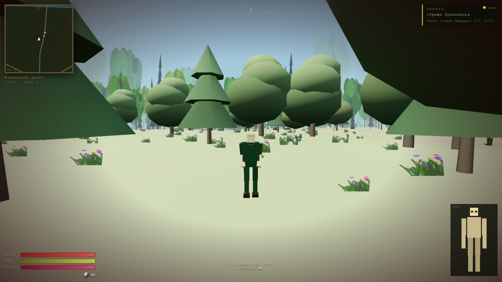

# КОРОВАНЫ: ЧЕТЫРЕ ЗЕМЛИ 🌲⚔️☠️

**3D-экшон по ТЗ Кирилла.** Три играбельные стороны — лесные эльфы, охрана дворца и
злодей Владыка Дрегар; четыре зоны на одной бесшовной карте 2×2 км; густой лес, который
вдали нарисован картинками, а вблизи превращается в объёмные деревья; корованы, которые
можно грабить; отрубленные руки, выбитые глаза, ноги, ползание, коляска и протезы.

> «Здраствуйте. Я, Кирилл. Хотел бы чтобы вы сделали игру, 3D-экшон суть такова…
> Можно грабить корованы… И враги 3-хмерные тоже, и труп тоже 3д… P.S. Я джва года хочу такую игру.»

Реализация: **DeepSeek-V4.1-Flash (uncensored)**, чистый JavaScript + [three.js](https://threejs.org/)
из CDN, без сборщика — просто открой `index.html`.



---

## 🎮 Как играть

* **Онлайн (GitHub Pages):** https://rai220.github.io/korovany/deepseek_4.1_flash_uncesoured/
* **Локально:**

```bash
cd deepseek_4.1_flash_uncesoured
python3 -m http.server 8123      # или npm run serve
# открыть http://localhost:8123/deepseek_4.1_flash_uncesoured/
```

Мышь захватывается по клику. Если курсор «убежал» — кликни по экрану. Esc — пауза.

## 🧭 Три стороны конфликта

| Сторона | Где живёт | Чем занимается |
|---|---|---|
| 🏹 **Лесные эльфы** | Луннолесье (зона 3): дома на ветвях, верёвочные мосты, священная роща | Защищают деревню от солдат дворца и теней Дрегара, грабят корованы на тракте, слушают старейшину |
| 🛡️ **Охрана дворца** | Златоверхий дворец (зона 2): стены, башни, казармы, плац | Слушаются капитана Ратмира: патруль, отлов шпионов, отпор партизанам, набеги на лес и форт, звание до Тысячника |
| ☠️ **Злодей — Владыка Дрегар** | Чёрный Шпиль (зона 4): горный форт, клетки с пленными, кузня | Сам себе командир: грабит корованы, нанимает легион, приказывает отряду идти в атаку на дворец и садится на трон |

Свободная игра после победы не заканчивается — мир живёт дальше: идут корованы,
случаются набеги, шпионы Дрегара пробираются в казармы, партизаны жгут хутора.

## 🗺️ Четыре зоны (одна карта, без загрузок)

1. **Земли людей (нейтрал)** — деревня Тихий Брод, кабак «Пьяный вепрь», кузница, мельница, торг, лагерь разбойников, развалины.
2. **Земли Императора** — Златоверхий дворец с золотым куполом, стены с зубцами, ворота, казармы, плац, тронный зал.
3. **Луннолесье** — густая чаща, деревня на ветвях, священная роща, лагерь партизан, лучный тир.
4. **Владения Владыки Дрегара** — горы, перевал, старый форт со цитаделью, кузня, невольничий рынок.

Между зонами — тракт, река с двумя каменными мостами, заставы и костры. Всё это
можно пройти пешком от края до края: подгрузок нет.

## 🌲 Лес как в ТЗ: картинка → 3D

* ~**23 000 деревьев** рассажены процедурно по всему миру (в эльфийской чаще — плотно).
* Дальше 72 метров дерево — **билборд-картинка** (один instanced-меш, один draw call,
  покачивание на ветру, туман и прозрачность считаются в шейдере).
* Ближе 72 метров картинка гаснет, а на её месте **вырастает объёмное 3D-дерево**
  (ствол + крона из нескольких ярусов, тени). Переход сглажен анимацией роста.
* Трава, папоротники, цветы и камыш — отдельный instanced-слой с дистанционным
  появлением, камни и кусты — тоже.

## 💀 Расчленёнка, раны и протезы (ключевая механика ТЗ)

Тело и у игрока, и у любого врага собрано из отдельных частей. Удар приходится
в конкретную часть — по высоте попадания.

| Травма | Что происходит | Как лечить |
|---|---|---|
| 🩸 Рука отрублена | Кровотечение, хват ослаблен (двуручное и лук — хуже), отрубленная рука отлетает и остаётся лежать | Бинт **[F]** останавливает кровь; костоправ ставит **крюк** или **механическую руку** |
| 👁️ Глаз выбит | **Пол-экрана чернеет** (правый/левый), при двух — щёлка | Стеклянный глаз у костоправа возвращает обзор |
| 🦵 Нога отрублена | Хромота; без двух ног — **ползание** | Костыли-протезы, **коляска [G]** (езда быстрее ползания) или протез у костоправа |
| 🩸 Кровотечение | Полоса крови падает; без перевязки — смерть | Бинт, отвар, лекарь |
| ☠️ Смерть | Труп остаётся в мире, его можно **обыскать** | Очнуться у лекаря (часть золота уходит) или загрузить сохранение |

Враги калечатся так же: подстрелишь ногу — поползёт, отрубишь руку — бросит двуручник,
попадёшь в голову — снесут череп. Отрубленные конечности и трупы — трёхмерные,
кровь брызжет частицами и остаётся лужами.

## 🐂 Корованы и экономика «как в Daggerfall»

* По тракту между Тихим Бродом и дворцом ходят **корованы**: волы, телеги, охрана,
  товар. Нападёшь — охрана берётся за оружие, побьёшь всех — забирай добро из телег.
* **Лавки:** кузнец, лучный мастер, торговец, травница, лекарь, костоправ, кабатчик,
  меняла (банк с вкладом, займом и процентами), наставник (прокачка навыков), работорговец.
* **Торг:** можно сбить цену красноречием; цены зависят от репутации и навыка торговли.
* **Сон** в кабаке/казарме двигает время и лечит, **быстрый переход** по открытым местам
  через карту **[M]**, покупка снаряжения, зелий, бинтов, отмычек и протезов.
* Навыки растут от использования: клинок, стрельба, блок, скрытность, красноречие,
  атлетика, выносливость, торговля. Уровни дают здоровье и силу.

## 🎯 Приказы и командование

* **Охрана дворца.** Капитан Ратмир выдаёт приказы (патруль стен, отлов шпиона, отпор
  партизанам, набег на Луннолесье, штурм Чёрного Шпиля, мелкие поручения). За службу —
  золото, репутация и звание: рядовой → капрал → сержант → сотник → тысячник. Гвардейцев
  можно позвать за собой.
* **Злодей.** В форте нанимаются легионеры, тёмные лучники и громилы. Приказы отряду:
  «за мной», «держать позицию», «в атаку» **[T]**, **[Y]**, **[H]**. Финальная цель —
  провести отряд к дворцу, вырезать гвардию с капитаном и водрузить знамя на трон.
* **Эльфы.** Старейшина даёт поручения: проредить солдат, ограбить корованы, отбить налёт,
  убить Дрегара. Партизаны и лучники воюют рядом.
* **Динамика.** Налёты случаются сами: империя идёт на эльфов, легион Дрегара — на деревню,
  разбойники — на тракт. Шпионы Дрегара работают под видом слуг.

## 🕹️ Управление

| Клавиши | Действие |
|---|---|
| W A S D / мышь | идти / обзор |
| ЛКМ / ПКМ | удар / блок |
| Shift / Space / Ctrl | бег / прыжок / присесть |
| E | говорить, обыскать, открыть, взять |
| R, 1–4 | сменить оружие, быстрые слоты (бинт, зелье…) |
| F | перевязать рану · **G** — коляска · L — факел |
| I / C / J / M / T | сумка, персонаж, журнал, карта, отряд |
| V | вид от 1-го / 3-го лица |
| F5 / F9, Esc | быстрое сохранение / загрузка, пауза и меню |
| F3 | отладочная строка |

Телефон/планшет: слева виртуальный стик, справа свайп-обзор, кнопки действий внизу.

## 🛠️ Технически

* **Стек:** ES-модули + three.js r160 из CDN (importmap), никакой сборки. Всё — статика.
* **Производительность:** инстансинг (лес, трава, камни, частицы), LOD-подмена деревьев,
  чанки рельефа 128 м с фрустум-отсечением, склейка геометрии поселений в один меш,
  склейка частей тела, отключение теней и скрытие далёких НПС, автоскидывание качества при
  низком FPS. В типичной сцене ~350 draw calls.
* **Мир детерминирован сидом:** рельеф, река, дороги, лес, население и лут восстанавливаются
  из одного числа. Сохранение хранит только дельту (игрок, задания, трупы, контейнеры, время).
* **Сохранения:** 4 слота + автосейв в `localStorage` (F5 — быстрый сейв, Esc — меню).
* **Звук:** полностью процедурный WebAudio (удары, шаги по материалу, природа, музыка зон,
  гром), без файлов.
* **Свет и погода:** цикл суток, солнце/луна/звёзды, туман по времени суток, дождь и гроза.

### Структура

```
index.html          экран загрузки, меню, HUD, панели, importmap
style.css           тёмное фэнтези: золото, пергамент, кровь
src/
  main.js           запуск, меню, игровой цикл, связка систем
  core/             состояние и шина событий, ввод, звук, математика, шум/сид
  world/            рельеф и зоны, LOD-лес, окружение, поселения, коллизии, небо и погода
  entities/         гуманоиды (части тела, расчленение, анимации), игрок (травмы, протезы)
  systems/          бой и кровь, ИИ и отряды, экономика, задания и диалоги, корованы, сохранения
  ui/               HUD, миникарта, силуэт тела, все панели, карта мира
tests/              smoke.mjs, play.mjs, shots.mjs — прогоны в headless Chrome
```

### Тесты

```bash
node tests/smoke.mjs   # 30 проверок: три фракции, лес, бой, травмы, сохранения
node tests/play.mjs    # «живой» прогон: ввод, бой, лавки, приказы, панели, сейвы
node tests/shots.mjs   # скриншоты зон в tests/*.png
```

Тесты поднимают локальный сервер, гоняют Chrome headless по CDP и печатают отчёт.

## ⚠️ Ограничения

* Нужен современный браузер с WebGL2 (Chrome/Edge/Firefox/Safari 16+). На слабых машинах
  игра сама снижает тени и дальность.
* Мир процедурный: интерьеры условные (дворец и форт — открытые площади с залами-платформами).
* Полноценного ragdoll-физика нет: трупы и конечности падают по упрощённой модели.

## 📜 Лицензия

Игра — вольная реализация ТЗ Кирилла. Делай что хочешь, только корованы не забудь.
