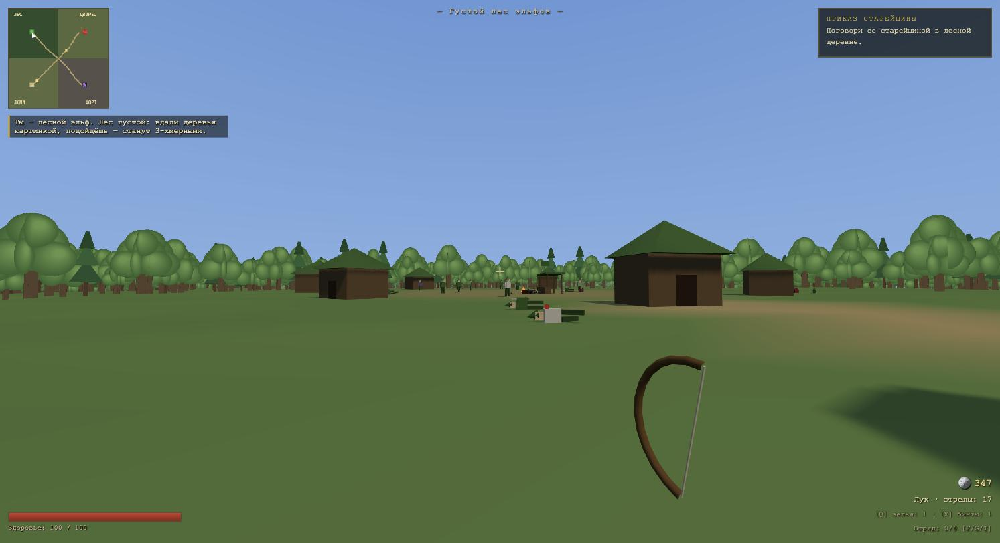

# КОРОВАНЫ — вариант Fable 5.1

3Д-экшон по ТЗ Кирилла, сделан с нуля моделью Fable 5.1. Чистая статика:
Three.js (ES modules с CDN), один `main.js`, без сборки. Вид от первого лица.

**Играть:** https://rai220.github.io/korovany/fable_5_1/

## Что реализовано из ТЗ

- **Три фракции на выбор**: лесные эльфы (лук, густой лес, деревяные домики),
  охрана дворца (надо слушаться командира) и Злой — имя он так и не придумал
  (сам себе командир, старый форт в горах).
- **4 зоны** на одной бесшовной карте 1.6×1.6 км: земли людей (нейтрал),
  владения Императора с дворцом, густой лес эльфов, горы Злого со старым
  фортом (две стены форта разрушены — форт старый).
- **LOD-лес**, как просил Кирилл: ~6200 деревьев, вдали — картинкой
  (инстансированные кросс-билборды), ближе 72 метров они преобразовываются
  в 3-хмерные деревья. Плотность — до ~140 объёмных деревьев вокруг игрока.
- **Можно грабить корованы**: два корована с повозками, лошадьми и охраной
  ходят по тракту деревня → перекрёсток → дворец. Пока охрана жива, грабёж
  не выйдет — она защищает груз. Перебил — забирай кассу [E].
- **3-хмерные враги и труп тоже 3д**: боевой ИИ трёх воюющих фракций,
  нейтральные крестьяне разбегаются, трупы остаются лежать и обыскиваются.
- **Расчленёнка**: отрубленные руки/ноги/головы отлетают физикой и остаются
  лежать; враг может драться и с одной рукой. У игрока: отрубленная рука
  (кровотечение — если не перевязаться [X], умрёшь; лук недоступен),
  выколотый глаз (пол-экрана не видно), отрубленная нога (ползком).
- **Лекарь**: перевязка, лечение, протез руки, стеклянный глаз, коляска
  (кататься) или протез ноги — «самое хорошее».
- **Можно покупать и т.п. возможности как в Daggerfall**: лавки во всех
  четырёх зонах — зелья, бинты, стрелы, лук, мечи получше, найм бойцов
  в отряд (в лавке своей базы).
- **Приказы**: за охрану — командир даёт приказы (патруль стен, оборона
  дворца от набега, набеги на эльфов и на форт), награда золотом за службу.
  За эльфов — задания старейшины (ограбить корован, отбить набег, вылазки).
  За Злого — ты сам себе командир: собери войско, прикажи ему [T] с тобой
  самим напасть на дворец — и пойдёт в атаку. Шпионы и партизаны эльфов
  иногда нападают на форт.
- **Отряд**: найм до 6 бойцов, приказы F (за мной) / G (стоять) / T (В АТАКУ).
- **Можно прыгать и т.п.** Space.
- **Сохранятся можно**: K или из паузы, продолжение из главного меню,
  загрузка после смерти. Автосохранение при сдаче заданий.

## Управление

| Клавиша | Действие |
|---|---|
| WASD, Shift | движение, бег |
| Space | прыжок |
| Мышь, ЛКМ | осмотр, атака |
| 1 / 2 | меч / лук |
| E | обыскать труп / грабить корован / говорить / лавка |
| Q | зелье здоровья |
| X | перевязать кровотечение |
| F / G / T | отряд: за мной / стоять / В АТАКУ |
| K | сохранить |
| Esc | пауза |

## Технические детали

- Three.js r160 через importmap с jsdelivr, никаких сборщиков.
- Детерминированный мир (seeded RNG): рельеф, лес и постройки одинаковы
  в каждой сессии — сохранения совместимы с миром.
- Рельеф — аналитическая функция высоты (горы на юго-востоке, плато форта,
  плоские площадки поселений, приглаженные дороги), вершинные цвета зон.
- Гуманоиды собраны из боксов с пивотами конечностей — поэтому конечности
  отрубаются по-настоящему: пивот отсоединяется и улетает отдельным телом.
- Дебаг-хук `window.__kor` (телепорт, золото, травмы) — читы в духе ТЗ.
- `?simfallback` в URL — тестовый цикл симуляции для скрытых вкладок
  (обходит заморозку requestAnimationFrame при автоматизированном тестировании).
