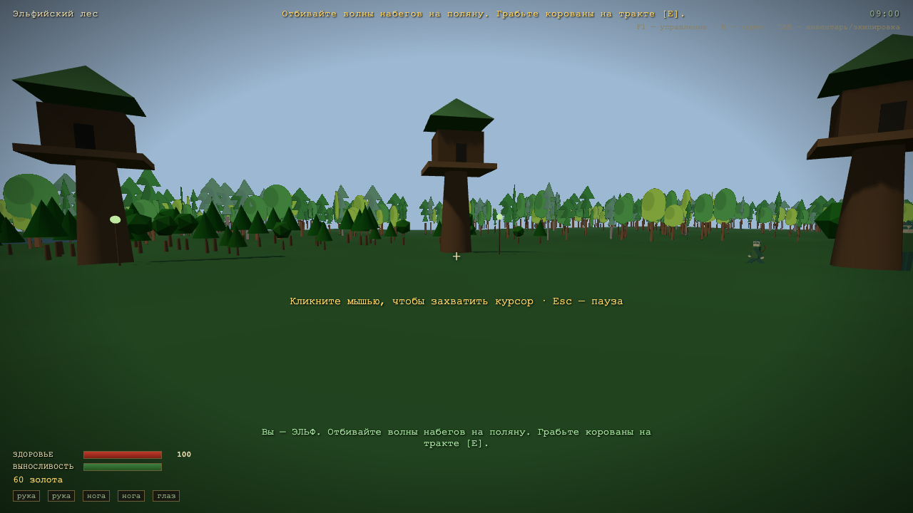

# ДЖВА ГОДА — вариант hermes_ox_alpha

3D-экшон от первого лица по легендарному ТЗ Кирилла («джва года хочу такую игру»).
Three.js через CDN (importmap), чистая статика без сборки — работает на GitHub Pages.

## Как играть

Открыть `index.html` (через любой статический сервер). Выбрать фракцию:

- **Лесные эльфы** — густой родной лес, лук, отбивать набеги, грабить корованы.
- **Охрана дворца** — слушаться командира Гарета [E], защищать дворец от шпионов,
  партизан-эльфов и отрядов Злого, потом самому ходить в набеги.
- **Злой (Варгхаст)** — сам себе командир: нанимать войско [E], командовать [C]
  и штурмовать дворец Императора [V].

### Управление

| Клавиша | Действие |
|---|---|
| W A S D / мышь | движение / обзор |
| Shift / Space | бег / прыжок |
| ЛКМ | удар мечом или выстрел из лука |
| R | сменить оружие (меч ⇄ лук) |
| E | говорить · грабить корован · обыскать труп · лавка · наём |
| C | приказ отряду «в атаку / за мной» |
| V | начать штурм дворца (за злого) |
| B | перевязать рану бинтом |
| M | карта мира (клик — быстрое перемещение) |
| TAB | инвентарь, травмы, протезы |
| F5 / F9 | сохранение / загрузка (localStorage) |

## Что внутри

- **Мир 2×2 км, 4 зоны**: земли людей с деревней, владения Императора с дворцом
  (стены, башни, донжон), эльфийский лес с домиками на деревьях, горный форт Злого.
- **LOD-лес**: ~9000 деревьев; вдали рисуются «картинкой» (инстансированные
  билборды одним draw call), ближе 70 м подменяются объёмными 3D-деревьями
  (пул из 900 инстансов стволов и крон). В чаще одновременно видно ~90 объёмных
  и ~8900 картинок при ~50 draw calls всего кадра.
- **Корованы**: повозка с упряжкой из двух лошадей и охраной ходит по тракту через
  реку по мосту; помечены флагом, меткой в HUD и точкой на карте. Можно грабить [E].
- **Бой**: мечи, луки с баллистикой стрел, дубины. ИИ трёх фракций воюет друг
  с другом, волны набегов по сценарию фракции, штурм дворца с победой и наградой.
- **Расчленёнка как в ТЗ**: врагу можно отрубить руку или ногу — конечность
  отлетает и остаётся лежать. Игроку тоже: отрубленная рука/нога кровоточит
  (не перевяжешь или не полечишься — умрёшь), выбитый глаз закрывает половину
  экрана, без ног — ползком или на коляске. Лекарь ставит протезы.
- **Экономика как в Daggerfall**: лавки (оружейник, лавка, лекарь) в деревне,
  у эльфов, у дворца и в форте: стрелы, бинты, лечение, протезы (рука/нога/глаз),
  коляска, заточка меча.
- **Трупы 3D** — обыскиваются на золото/стрелы/бинты, исчезают через минуту.
- **Сохранения** в localStorage: позиция, здоровье, травмы, протезы, золото,
  отряд, время суток.

## Технические детали

- Three.js 0.160 через importmap с CDN (`unpkg.com`), ES-модули без сборки.
- Всё содержимое генерируется кодом: текстуры деревьев рисуются на canvas,
  гуманоиды/лошади/постройки — из примитивов. Никаких внешних ассетов.
- Рельеф — аналитическая функция высоты (шум + горы + русло реки + плато баз),
  та же функция используется для коллизий и расстановки леса.
- Файлы: `js/world.js` (мир), `js/forest.js` (LOD-лес), `js/actors.js`
  (ИИ, стрелы, корованы), `js/player.js` (игрок, травмы), `js/ui.js`
  (HUD, экраны), `js/main.js` (сценарии фракций, сохранения).

